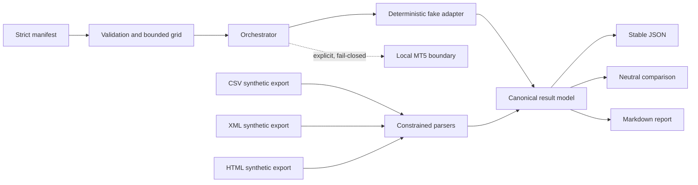

# MT5 Backtesting Toolkit

A Python toolkit for validating, orchestrating, and parsing reproducible MetaTrader 5 backtest
experiments. The repository ships with deterministic synthetic examples and a fake runner, while
keeping strategies, broker data, credentials, and real performance results outside the project.

> [!IMPORTANT]
> This is engineering and educational software, not financial advice. No trading strategy,
> performance promise, broker integration, or investment recommendation is included.

## Why this project exists

Backtest automation often mixes experiment definitions, terminal details, parsing, and analysis.
This toolkit separates those concerns behind small typed boundaries. You can validate a manifest,
exercise the complete workflow on any operating system with deterministic fake results, parse the
project's deliberately narrow synthetic export schemas, and generate neutral technical reports.



No source repository history, Expert Advisor, strategy preset, real report, market dataset, account
identifier, or broker credential is part of this repository.

## Quick start

Python 3.12 is required.

### Linux and macOS

```bash
python3.12 -m venv .venv
. .venv/bin/activate
python -m pip install -e .
mt5bt validate-manifest examples/manifests/synthetic_grid.yaml
mt5bt run examples/manifests/synthetic_grid.yaml --adapter fake
mt5bt parse examples/synthetic_exports/results.csv
```

### Windows PowerShell

```powershell
py -3.12 -m venv .venv
.\.venv\Scripts\Activate.ps1
python -m pip install -e .
mt5bt validate-manifest examples\manifests\synthetic_grid.yaml
mt5bt run examples\manifests\synthetic_grid.yaml --adapter fake
mt5bt parse examples\synthetic_exports\results.csv
```

The fake adapter performs no network calls, does not launch MetaTrader, and derives every ID,
duration, and metric from a stable digest. Use `--fake-scenario failure` or
`--fake-scenario timeout` to exercise terminal states without waiting.

## Manifest

The manifest has a strict schema: unknown fields, secret-like parameter names, unsafe output paths,
invalid dates, excessive timeouts, and parameter products above the declared limit are rejected.

```yaml
schema_version: "1"
experiment_id: synthetic-grid
strategy_id: SYNTHETIC_EXAMPLE
symbol: SYNTH_A
account_label: DEMO-001
timeframe: M15
date_range:
  start: 2024-01-01
  end: 2024-01-31
execution_mode: grid
timeout_seconds: 30
retry:
  max_attempts: 2
  backoff_seconds: 0
parameters:
  fixed:
    param_fixed: 10
  grid:
    param_a: [1, 2]
    param_b: [alpha, beta]
combination_limit: 8
output_directory: outputs/synthetic-grid
```

Credentials are not valid manifest data. Paths are workspace-relative and checked for POSIX
traversal, Windows drives and UNC syntax, and symlink escape.

## Parse, compare, and report

The example exports are synthetic and conform to project-owned schemas; the parsers do not claim
compatibility with every report generated by MetaTrader.

```bash
mt5bt parse examples/synthetic_exports/results.html > parsed.json
mt5bt compare run-a.json run-b.json
mt5bt report run-a.json --format markdown
```

Comparison is intentionally mechanical: each delta is `right - left`. The toolkit does not score,
rank, select, or recommend a result. Metrics are parsed engineering outputs, not endorsements or
evidence of expected returns.

## Local MetaTrader 5 boundary

Version 0.1.0 includes a Windows-oriented, fail-closed `LocalMt5Adapter` boundary for validating a
user-supplied terminal path and configuration path. Both paths must live inside an explicitly
configured workspace, command construction uses an argument list, and explicit opt-in is required.
The adapter does **not** launch MetaTrader in this release. Users must supply and lawfully operate
their own platform, data, licenses, and strategy. See
[the Windows adapter guide](docs/windows-mt5-adapter.md).

## Security and privacy

- YAML is loaded without executing custom objects and duplicate keys are rejected.
- Parameter combinations, report sizes, retries, and timeouts are bounded.
- XML parsing uses entity-safe parsing.
- Synthetic exports require an unmistakable disclaimer marker.
- Diagnostics can redact credential assignments and personal home paths.
- CI has least-privilege permissions and runs tests without credentials, networks, brokers, or MT5.

See [Security and privacy](docs/security-and-privacy.md), [SECURITY.md](SECURITY.md), and the
[clean-room provenance statement](docs/provenance.md).

## Development and CI

Development dependencies are fully resolved with hashes in `requirements-dev.lock`.

```bash
python3.12 -m venv .venv
. .venv/bin/activate
python -m pip install --require-hashes -r requirements-dev.lock
python -m pip install --no-build-isolation --no-deps -e .
ruff check .
ruff format --check .
mypy
pytest --cov --cov-config=pyproject.toml --cov-report=term-missing
python -m build
twine check dist/*
python -m pip check
gitleaks git --redact --no-banner .
pip-audit -r requirements-dev.lock --require-hashes
```

Stable CI check names are `quality-linux`, `tests-linux`, `tests-windows`, `package-smoke`,
`gitleaks`, and `dependency-audit`. The Windows job tests path and adapter boundaries only; it
never launches MetaTrader.

## Roadmap

- Versioned import profiles for additional user-supplied synthetic schemas.
- Atomic artifact workspaces and resumable experiment ledgers.
- A separately reviewed opt-in local process executor with cancellation.
- Reproducibility metadata and schema migration tooling.

## Project policies

Contributions must stay strategy-neutral and use synthetic fixtures. Read
[CONTRIBUTING.md](CONTRIBUTING.md), [CODE_OF_CONDUCT.md](CODE_OF_CONDUCT.md),
[DISCLAIMER.md](DISCLAIMER.md), and [THIRD_PARTY.md](THIRD_PARTY.md).

The newly implemented project code is licensed under Apache-2.0. MetaTrader and MetaQuotes are
third-party trademarks; this project is independent and is not endorsed by or affiliated with
their owners.
